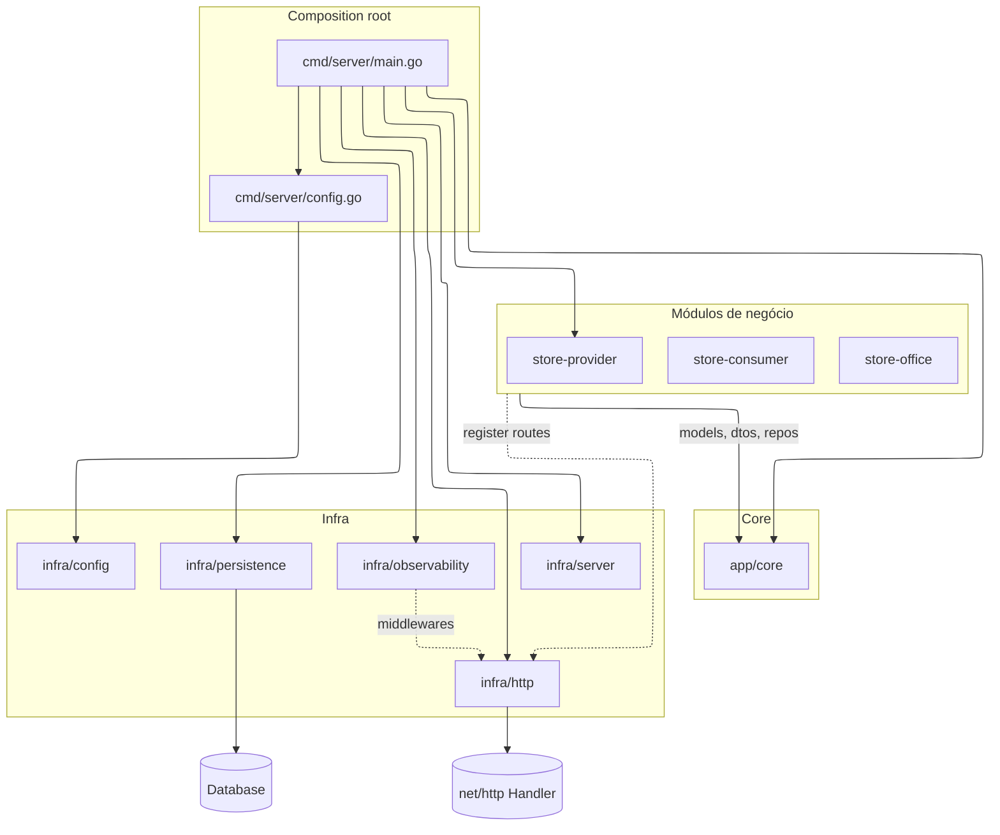

# Minha loja de aplicativos

Loja de aplicativos para terminais do ponto de venda (PDV): parceiros publicam aplicativos e versões; o PDV consulta o catálogo compatível com o seu terminal e solicita instalação.

## Papéis (consumidores)

1. **Time da loja (backoffice)**
   - Cadastrar filtros de segmentação (região, ramo, sub-ramo etc.)
   - Cadastrar modelos de terminais suportados
   - Cadastrar configurações de terminais (associar modelo a um tipo de integração com app financeiro)
   - Aprovar promoção do **perfil do aplicativo**: revisão → produção
   - Aprovar promoção da **versão do aplicativo**: pendente → piloto
   - Aprovar promoção da **versão do aplicativo**: piloto → produção

2. **Parceiros (publicadores)**
   - Cadastrar aplicativo
   - Cadastrar perfis de aplicativos associados a filtros previamente cadastrados (região, ramos, sub-ramos etc.)
   - Informar dados de vitrine e contato (nome, e-mail, site, telefone), ícone, screenshots e descrições
   - Cadastrar versões de aplicativos previamente certificadas para uma determinada configuração de terminal

3. **App da loja (cliente / PDV)**
   - Consultar aplicativos disponíveis para o terminal do PDV, considerando filtros do perfil do aplicativo e a configuração do terminal
   - Solicitar instalação de aplicativo no terminal do PDV

## Estrutura (ideia de modularização)

Separação por domínio/módulo, mantendo o “core” reutilizável (modelos, DTOs, repositórios e acesso a dados) e módulos específicos por contexto (provider/office/consumer).

Nota: `audit` existe tanto em `models` quanto em `dtos` porque nem sempre o contrato da API (DTO) é igual ao modelo de dados/persistência.

Obs.: quando formos criar o esqueleto no disco, diretórios vazios podem ser mantidos com `.gitkeep`.

Basepath da aplicacao: app

## Arquitetura

O projeto começa como um **monólito modular**: uma única aplicação executável, porém organizada em módulos por domínio para manter baixo acoplamento e facilitar uma evolução futura.

### Objetivo

- Manter os módulos de domínio (`store-*`) **auto contidos** (bounded contexts) e evoluíveis de forma independente.
- Centralizar no `core` tudo que é **comum/reutilizável** entre módulos.
- Permitir, se necessário no futuro, “quebrar” o monólito em múltiplos backends reaproveitando o `core` como uma biblioteca.

### Papel de cada parte

- `app/cmd/*`: entrypoints (composition root). Aqui a aplicação sobe servidor(es), injeta dependências e registra rotas.
- `app/core/*`: componente **comum e reutilizável**. Contém:
  - `models` e `dtos` (podem divergir; conversões explícitas quando necessário)
  - persistência/storage (hoje em `databases` e `repositories`; pode evoluir para `storage`)
  - utilitários/abstrações (ex.: interfaces e helpers compartilhados)
  - healthcheck simples (sem acoplar regras de negócio)
- `app/store-provider|store-office|store-consumer/*`: módulos de domínio **auto contidos**.
  - `handlers`: somente abstrações/interfaces e healthcheck do módulo (quando existir)
  - `services`: casos de uso / regras da aplicação do módulo
  - `routers`: composição/roteamento do módulo

### Regras de dependência (para manter a modularidade)

- `store-*` pode depender de `core`, mas **`core` não depende de `store-*`**.
- Evitar comunicação direta entre módulos (`store-A` chamando `store-B`). Quando for necessário, preferir contratos explícitos (interfaces/eventos) no `core`.
- DTOs não são “o domínio”: quando o contrato da API diferir do modelo, manter o mapeamento explícito (sem “vazar” detalhes de persistência para a API).

### Diagrama (visão macro do projeto)



### Evolução futura

Se o monólito precisar virar múltiplos backends, a intenção é manter:

- Um projeto (ou módulo) `core` como biblioteca compartilhada
- Um backend por contexto (`provider`, `office`, `consumer`) consumindo o mesmo `core`

```text
core
  databases
    migration.go
    mysql_connector.go
    sqlite_connector.go
  repositories
    base_repository.go
  models
    entity_interface.go
    base_audit.go
  dtos
    dto_interface.go
    base_audit.go

store-provider
  services
  handlers
  routers

store-office
  services
  handlers
  routers

store-consumer
  services
  handlers
  routers
```

## Configuração (variáveis de ambiente)

O entrypoint atual é `app/cmd/server` e lê configuração via variáveis de ambiente.

### Server

- `PORT` (default: `8080`)
- `READ_HEADER_TIMEOUT` (default: `5s`)

### HTTP

- `HTTP_DRIVER` (default: `gin`, suportados: `gin`, `chi`)

### CORS

- `CORS_ENABLED` (default: `true`)
- `CORS_ALLOW_ORIGINS` (default: `*`)
- `CORS_ALLOW_METHODS` (default: `GET,POST,PATCH,DELETE,OPTIONS`)
- `CORS_ALLOW_HEADERS` (default: `Content-Type,Authorization`)
- `CORS_EXPOSE_HEADERS` (default: vazio)
- `CORS_ALLOW_CREDENTIALS` (default: `false`)
- `CORS_MAX_AGE` (default: `10m`)

Nota (produção): evite `CORS_ALLOW_ORIGINS=*` se você precisa restringir origens. Prefira listar explicitamente as origens permitidas.

### Observability

- `OBS_REQUEST_ID` (default: `true`)
- `OBS_ACCESS_LOG` (default: `false`)
- `OBS_TELEMETRY` (default: `true`)
- `OBS_RECOVERY` (default: `true`)

Compatibilidade: se `OBS_TELEMETRY` não estiver definida, `OBS_ACCESS_LOG` também atua como alias para habilitar/desabilitar telemetry.

### Database

- `DB_DRIVER` (default: `mysql`, suportados: `mysql`, `sqlite`)
- `DB_DSN` (driver-specific)
- `DB_HOST`, `DB_PORT`, `DB_NAME` (ou `DB_DATABASE`), `DB_USER`, `DB_PASSWORD`
- `DB_OPTIONS` (CSV `k=v,k2=v2`)
- `DB_MIGRATE` (default: `false`)
