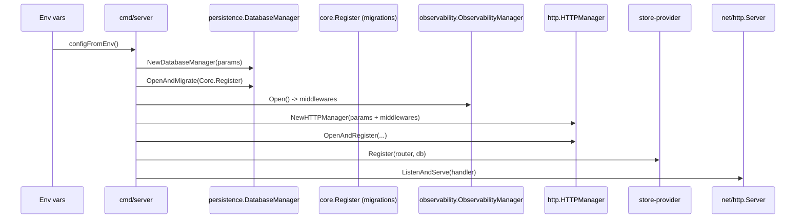

# Infra (app/infra)

Este módulo concentra as integrações e preocupações **infraestruturais** do serviço (HTTP, config, observability, persistência e server), seguindo um estilo **Ports & Adapters / Clean Architecture**.

## Objetivos

- Isolar frameworks e IO (Gin/Chi/net/http, Gorm, env vars) atrás de contratos simples.
- Centralizar **seleção de drivers** e **lifecycle** (open/close) com managers.
- Manter observabilidade consistente (request-id, access log, telemetry) com **labels de baixa cardinalidade**.
- Fornecer defaults seguros e guardrails (ex.: CORS).

## Regras de dependência (guidelines)

- O domínio/casos de uso ficam em `app/core`.
- `app/infra` pode depender de `app/core` quando necessário (ex.: contracts/tipos básicos, callback de migração), mas deve evitar “vazar” dependências de framework para fora.
- Entry points (composition root) vivem em `app/cmd/*` e orquestram:
  - leitura de config
  - construção de managers
  - wiring de middlewares
  - registro de rotas

## Mapa de módulos

- `config/`
  - `contracts.Source`: abstração de leitura (`Lookup`, etc)
  - `adapters/env`: implementação via variáveis de ambiente
  - `ports`: helpers de parsing (bool/int/duration/csv)
- `server/`
  - `ServerParams`: parâmetros do `net/http.Server` (ex.: `ReadHeaderTimeout`)
- `http/`
  - `HTTPManager`: seleciona driver (Gin/Chi) e monta runtime (router + handler)
  - `contracts.Router` / `contracts.Context`: API agnóstica de framework
  - `adapters/gin` e `adapters/nethttp`: bridges para frameworks
  - `ports`: helpers puros (ex.: CORS header policy)
- `observability/`
  - `ObservabilityManager`: monta/cacha middlewares por driver+config
  - `adapters/ginmw` e `adapters/httpmw`: middlewares por framework
  - `ports`: helpers puros (ex.: política de route label)
  - Detalhes em `observability/README.md`
- `persistence/`
  - `DatabaseParams`: DSN e parsing (mysql/sqlite)
  - `DatabaseManager`: open/close + migração opcional via callback
  - `contracts.DatabaseConnector`: conector por driver
  - `adapters/mysql` e `adapters/sqlite`

## Arquitetura (visão do módulo)

O diagrama macro do projeto (incluindo `store-*`, `core` e `infra`) fica no README raiz:

- ../../README.md#arquitetura

### Startup / fluxo de inicialização



## Decisões e guardrails importantes

### Driver selection (HTTP)

- Seleção via `HTTP_DRIVER` (normalizado no config) e validado no `HTTPManager`.
- Drivers suportados: Gin e Chi/net/http (ver `infra/http/types`).

### CORS (policy)

- Implementação é split entre:
  - regra pura (`infra/http/ports`)
  - aplicação de headers nos adapters (Gin/net/http)
- Guardrail: `AllowCredentials=true` **nunca** pode ser combinado com `AllowOrigins` contendo `"*"`. Nesta configuração inválida, nenhum header CORS é aplicado.

### Observabilidade

- Request correlation: request-id via middleware.
- Baixa cardinalidade:
  - o label `route` **nunca** deve cair para `URL.Path`.
  - quando não há template/pattern (ex.: 404), usamos `"unmatched"`.

### Persistência e migrações

- `DatabaseParams` suporta DSN direto ou DSN montado.
- Migração é opt-in via `DB_MIGRATE` e executada somente se o callback de migrator for fornecido.
- `DatabaseManager` é thread-safe (protege cache de `*gorm.DB`).

## Como evoluir (extensões típicas)

- Adicionar novo driver HTTP:
  - estender `infra/http/types` (enum + normalização)
  - criar adapter runtime em `infra/http/adapters/<driver>`
  - plugar no `HTTPManager.buildRuntime`
- Adicionar feature de middleware:
  - adicionar em `infra/observability/types.MiddlewareConfig`
  - implementar nos adapters (Gin/net/http)
  - incluir no builder em `infra/observability/observability_middlewares.go`
- Adicionar novo driver DB:
  - estender `infra/persistence/types` + `NormalizeDBDriver`
  - implementar `contracts.DatabaseConnector` em `infra/persistence/adapters/<driver>`
  - plugar no `persistence.Select`

## Testes e validações

Rodar suíte completa do módulo `app`:

```bash
go test ./...
```

Sanity check estático:

```bash
go vet ./...
```

Race detector (quando CGO estiver habilitado no ambiente):

```bash
# Requer CGO_ENABLED=1 e um toolchain C no Windows
go test -race ./infra/...
```
